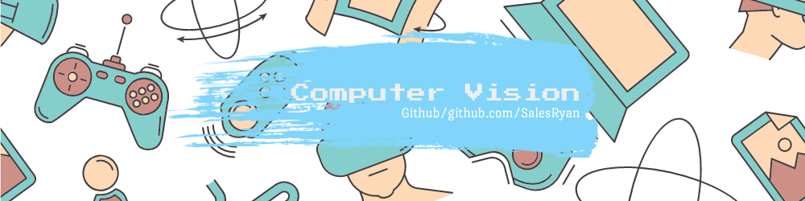
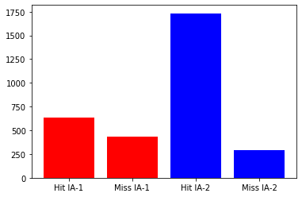

<p align="center">
  
</p>


# Ping-pong-control-by-neural-network
Repository dedicated to the creation of a ping pong game that uses neural networks to control rackets, and visualize the impact of network modeling and the learning rate.🤖

## Training view


We can see the training of the following networks, against each other by adjusting their weights or the progress of the game.

The purpose of this repository is to demonstrate in practice that no matter how much you know how to apply meeting networks to solve a problem, 
it is necessary to understand the problem and correctly model what the network will be based on to learn how to solve a certain problem.

In this example, the neural network that controls the red racket receives as input the spatial position (X, Y) of the ball and its own position,
thus being an entry with four values.
while in the blue racket the entry is only two values, the (Y) of the ball and the (Y) of the blue racket itself.


In the red neural network we have eight neurons in the hidden layer and the exit is in what position (Y) the racket should be to hit the ball.

On the other hand, the blue neural network has only 2 neurons in the hidden layer and also returns a position (Y) as an output.


## Results

<p>
  
</p>

Therefore, we can see that a simpler network with less input obtained a better result for this problem.
for this reason, study the perfect universe of neural networks, but don't forget to have the right vision to know how to model the networks. :)

## Requirements

- [Python3](https://www.python.org/downloads/release/python-382/) 

- *numpy*
```bash
pip install numpy
```
- *Pygame
```bash
pip install pygame
```

- *Matplotlib*
```bash
pip install matplotlib
```

## Installation

Clone this repository:

```bash
git clone https://github.com/SalesRyan/Ping-pong-control-by-neural-network.git
```

## About me

Graduation in Information Systems at the Federal University of Piau�, Possibility of experience with developing solutions in the area of Digital Image Processing, Computer Vision and Artificial Intelligence. I currently participate in research projects in the area of Vision and Computational Intelligence.

- [*LinkedIn*](https://www.linkedin.com/in/ryan-sales-2b10141a6/)
- [*Lattes*](http://lattes.cnpq.br/6944781068896428)
- [*Instagram*](https://www.instagram.com/sales.ryann/?hl=pt-br)
